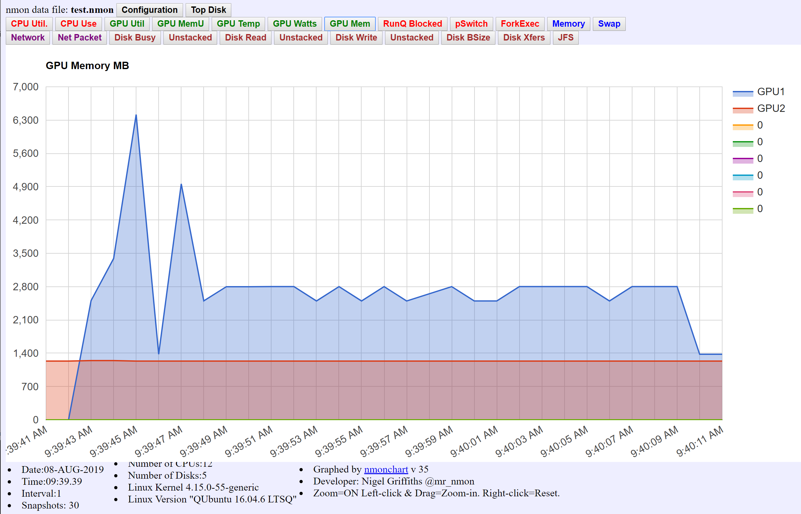

# nmon_gpu

This is Nigel Griffiths' `nmon` and `nmonchart` utilities updated for monitoring GPU memory.
http://nmon.sourceforge.net/pmwiki.php?n=Main.HomePage

Although the current code includes GPU support, I wanted to see and record GPU memory size rather than utilization. Also, I wanted the ability to show 8 GPUs instead of just 2.

I made some updates to the `16f` version of the code and included them in the `lmon.c` file in this repo.
Also, these changes required updating the `nmonchart` utility as well. Essentially the `GPU-MHz` was replaced with GPU memory stats.

Example screen with 2 GPUs here:

```
┌nmon─16j.dw──────────────────Hostname=dwendt-X299-ARefresh= 8secs ───16:42.
3 NVIDIA GPU Accelerator ──────────────────────────────────────────────────│
│ Driver Version:418.67    NVML Version: 10.418.67                         │
│ GPU  Memory       GPU-Util    Temp      Power                            │
│ No.  MiB          Proc Memory  °C       Watts    Name                    │
│  0     330/32478    0%   0%    40       24.73    Quadro GV100            │
│  1    1433/32470    0%   0%    43       25.90    Quadro GV100            │
│                                                                          │
│                                                                          │
│──────────────────────────────────────────────────────────────────────────│
```

You can build the source using the `build.sh` file.
Dependencies include `ncurses` and the `NVML` library from NVIDIA's installed CUDA/driver.

You can also just try the precompiled version here called `nmon_gpu`.

The `nmonchart` tool requires the `ksh` (Korn shell).



